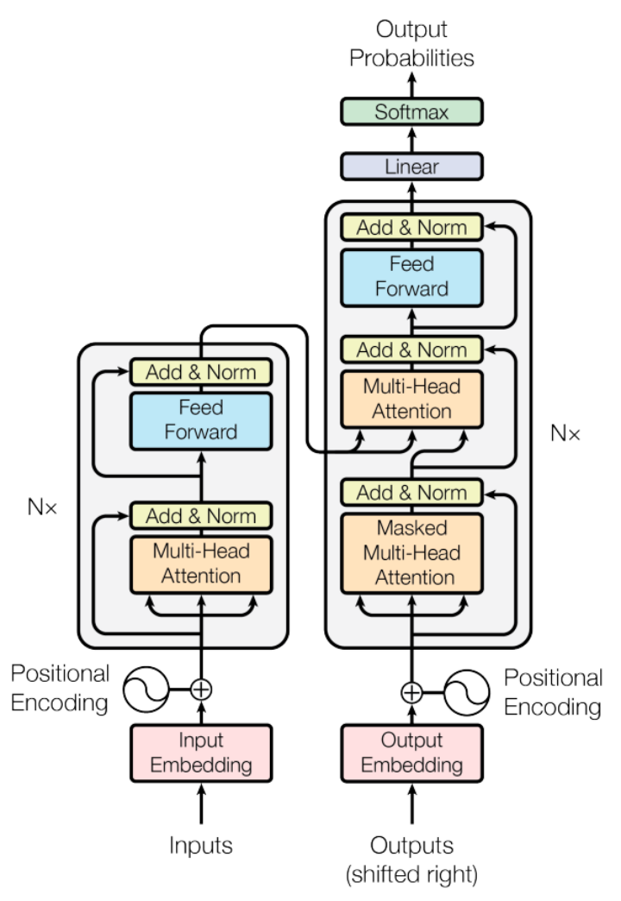

### Model architecture improvements

**一个基本架构，三种形式：**

当前流行的大模型的网络架构其实并没有很多新的技术，还是一直沿用当前NLP领域最热门最有效的架构——Transformer结构。相比于传统的循环神经网络（RNN）和长短时记忆网络（LSTM），Transformer具有独特的注意力机制（Attention），这相当于给模型加强理解力，对更重要的词能给予更多关注，同时该机制具有更好的并行性和扩展性，能够处理更长的序列，立马成为NLP领域具有奠基性能力的模型，在各类文本相关的序列任务中取得不错的效果。

根据这种网络架构的变形，主流的框架可以分为Encoder-Decoder, Encoder-Only和Decoder-Only，其中：

**1）Encoder-Only**，仅包含编码器部分，它接收输入序列，并将其转换为高级的特征表示，然后直接在这些表示的基础上进行预测。这种结构被广泛用于分类任务、实体识别、情感分析等NLP任务，在这些任务中，更关心输入序列的整体表示，而不需要生成新的序列作为输出。主要适用于不需要生成序列的任务，只需要对输入进行编码和处理的单向任务场景，如文本分类、情感分析等，这类代表是BERT相关的模型，例如BERT，RoBERT，ALBERT等。Encoder-Only 结构只包含编码器部分。

**2）Encoder-Decoder**，这类代表是以Google训出来T5为代表相关大模型。**编码器** 负责处理输入序列，将输入数据（比如文本序列）转换成一个中间的固定长度的表示形式，这个过程会捕捉输入数据的重要信息和上下文关系。编码器通常由多个编码层堆叠而成，每一层包含自注意力机制和前馈神经网络。**解码器** 则是基于编码器产生的中间表示来生成输出序列。每一层的解码器通过自注意力机制来处理所有之前生成的输出，通过编码-解码注意力机制来融合编码器的信息，最后通过前馈神经网络产出最终的输出序列。它也是由多个堆叠的解码层构成。**编码器** 负责处理输入序列，将输入数据（比如文本序列）转换成一个中间的固定长度的表示形式，这个过程会捕捉输入数据的重要信息和上下文关系。编码器通常由多个编码层堆叠而成，每一层包含自注意力机制和前馈神经网络。

这种架构适合于机器翻译、文本摘要、问答系统等任务，在这些任务里输入和输出都是序列化的数据。

**3）Decoder-Only**，仅包含解码器部分，通常用于序列生成任务，如文本生成、机器翻译等。这类结构的模型适用于需要生成序列的任务，可以从输入的编码中生成相应的序列。同时还有一个重要特点是可以进行无监督预训练。在预训练阶段，模型通过大量的无标注数据学习语言的统计模式和语义信息。这种方法可以使得模型具备广泛的语言知识和理解能力。在预训练之后，模型可以进行有监督微调，用于特定的下游任务（如机器翻译、文本生成等）。这类结构的代表也就是我们平时非常熟悉的GPT模型的结构，所有该家族的网络结构都是基于Decoder-Only的形式来逐步演化。